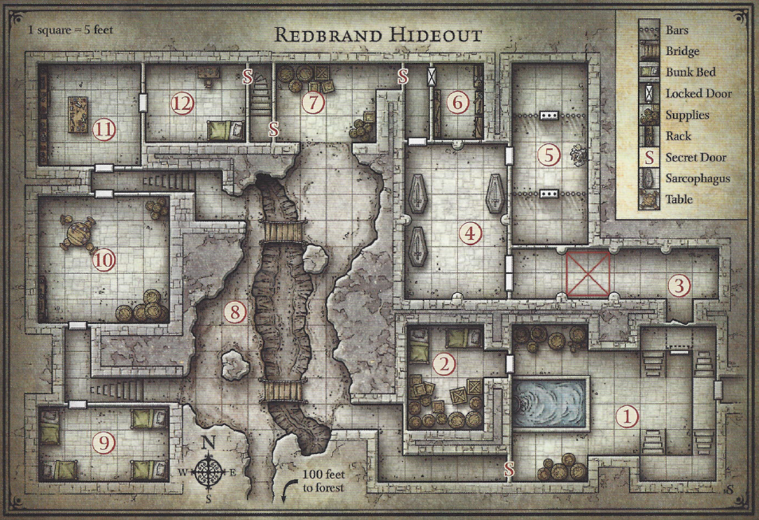

# Early User Interview; Next Steps

## Rough outline of questions
* How do you typically design a dungeon for a tabletop RPG?
* How do you determine and work on the layout of a dungeon?
* How large do you typically make your dungeons? How many discrete "areas" are there?
* Have you or do you use any online dungeon tools?

## Notes from talking to Nav
* How do you typically design a dungeon for a tabletop RPG?
    * Story first
    * Key figures -- character focused
    * Church, underground
    * How complicated?
        * Where is the difficulty?
        * Is it a long dungeon, is it a maze, or a big character encounter?
    * Multiple entrances and paths are good
* How do you determine and work on the layout of a dungeon?
* How large do you typically make your dungeons? How many discrete "areas" are there?
    * It depends
* Have you or do you use any online dungeon tools?
    * No

## Separate from the interview
Noted that a good way to help guide the development of the editor is to look at published dungeons and be able to recreate them inside of Pungeon.

### Redbrand Hideout

